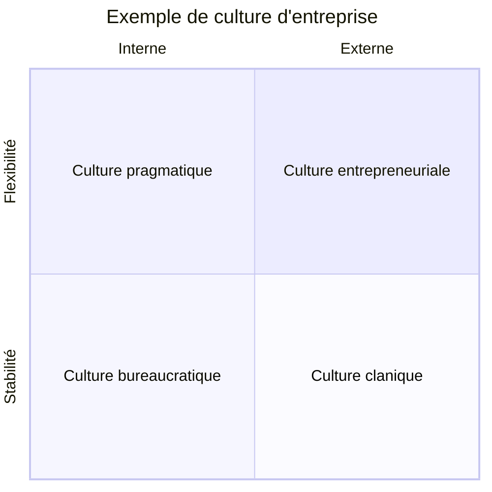
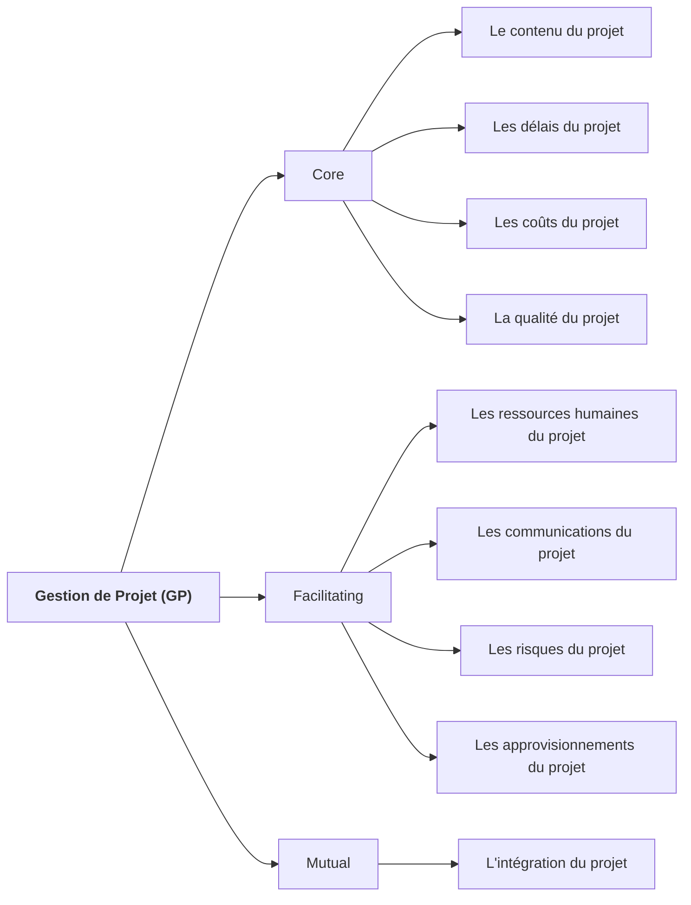

# Semaine 1

## Le PMBOK

PMI global standards provide guidelines, rules and characteristics for project, program and portfolio management. These standards are widely aceepted. When consistently applied, they help you and your organization achieve professional excellence.

+ Il est important de noter que le PMBOK n'est pas une méthodologie de gestion de projet mais bien un corpus de connaissances sur le sujet.

## Cultures Organizationnelle

Un projet, c'est:
+ Un processus unique de transformation de ressources
+ Ayant pour but de réaliser d'une façon ponctuelle
+ Produisant un extrant spécifique
+ Répondant à un ou des objectifs précis
+ À l'intérieur de constraintes budgétaires, matérielles, humaines et temporelles

## Types de projet

+ Ouvrage: résultat unique
    + un pont, un immeuble
+ Produit: mise au point d'une gamme de produit
    + nouveau modèle de voiture, nouvel aliment
+ Opération:
    + fusion de deux entreprises
+ Evénement:
    + Coupe du monde de soccer

> Projet: Entre innovation et standardisation
> Opération: Standardisation

## Définition de la GP

> Project management is "the application of knowledge, skills, tools and techniques to project activities to meet project requirements".

## L'importance de la gestion de projet en informatique

+ Pour atteindre des standards de qualité élevés
+ Pour augmenter la productivité
+ Diminuition de risques associés aux projets

### Les facteurs de succès:

Facteurs de Succès | Points
---|---
Support de la direction | 20
Implication des usagers | 15
Portée précise | 15
Réssources qualifiées | 13
Chargé projet avec du métier | 12
Méthodologie en place | 10
Objectifs d'affaires précis | 6
Maturité émotionnelle | 5
Exécution | 3
Infrastructure logicielle standard | 1

## Les 3P de la gestion de projet

+ People, Process, Product
+ 4e P: Technologie

**People**
+ Stakeholders
+ La culture de l'organization
+ Méthodes et outils de gestion et rencontre (Virtual Teams)

**Process**
+ Méthodologie (predictive, iterative, incremental, adaptive)
+ 6 groupes de processus
    + Démarrage
    + Plannification
    + Exécution
    + Surveillance et maîtrise
    + Clôture
+ Gestion et contrôle de la portée
+ Gestion de changement

**Product**
+ Deliverables
    + La charte du projet
    + Work Breakdown Structure (WBS)
    + Prototypes
    + Produit final

## Leadership

+ Un leader se concentre sur les objectifs à long terme et la vue d'ensemble tout en motivant l'équipe à atteindre ces objectifs.

+ Un gestionnaire se préoccupe des activités opérationnelles pour atteindre les objectifs

> Le chargée de projet doit être parfois gestionnaire parfois leader.

## Les 9 domaines de GP

+ 4 core knowledge areas lead to specific project objectives
+ 4 facilitating areas are the means through which the project objectives are achieved
+ 1 knowledge area that is mutually affecting and affected by other knowledge areas