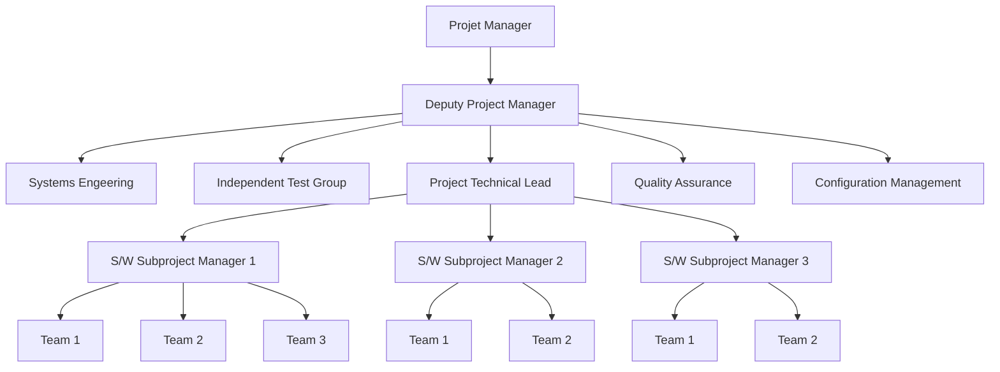
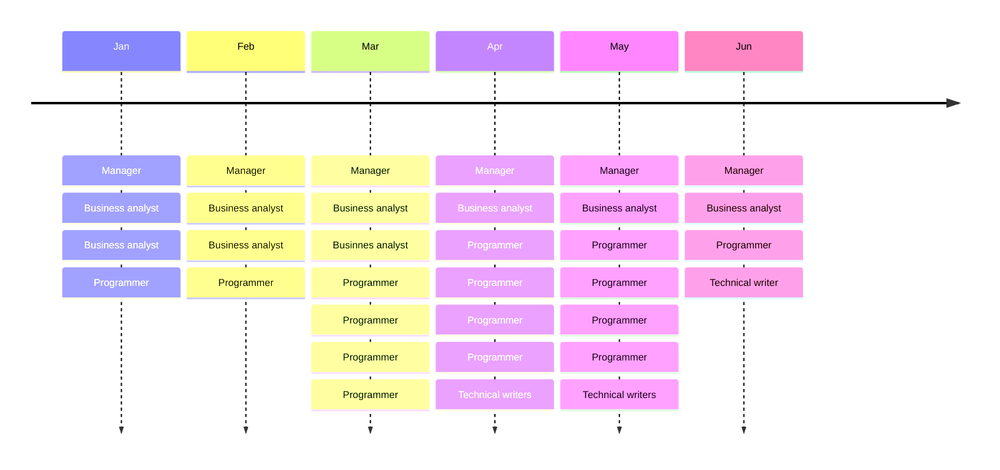

# Seance 11

## La gestion des ressources humaines (RH)

### Aptitudes et compétences

L'emphase du chargé de projet au quotidien devrait être centrée sur:

+ Les gens qui les font
+ La vision d'ensemble et la synthèse
+ L'équipe et l'esprit d'équipe
+ L'échange direct, l'écoute et le dialogue
+ Les besoins réels à combler
+ Le traitement des problèmes en temps réel
+ La négociation, le consensus et l'adhésion
+ Un rôle de pair et personne ressource et le charisme
+ Des relations horizontales-transversales
+ La capacité de tolérer le flou, l'incertitude et le bruit et d'en minimiser les impacts sur l'équipe
+ L'humilité pour pouvoir s'effacer devant l'équipe

#### Profil de sélection de Pettersen

> Performance = Habilités * Motivation * Personnalité

A. Résolution de problèmes
  1. Analyse des problèmes
  2. Jugement et sens pratique
  3. Habileté à prendre des décisions
B. Administration
  4. Planification & Organisation
  5. Contrôle
  6. Stratégie et savoir-faire organisationnel
  7. Connaissances spécialisées
C. Supervision / Gestion d'équipe
  8. Délégation de responsabilités
  9. Organisation d'équipe
  10. Considération envers l'équipe
  11. Développement de l'équipe
  12. Travail d'équipe et coopération
  13. Résolution de conflits
D. Relations interpersonnelles
  14. Communications orales
  15. Persuasion & Négociation
  16. Besoin d'influence
E. Autres qualités personnelles
  17. Besoin de réussir & proactivité
  18. Confiane en soi, maturité et stabilité émotionnelle
  19. Loyauté, honnêteté & intégrité
  20. Tolérance à l'ambiguïté & ouverture au changement
  21. Intérêt à la tâche

### Sélection

#### Choisir un chargé de projet

+ Connaissance pratique du domaine dans lequel le client du projet oeuvre

+ Apte à démontrer des compétences interpersonnelles dûment développées dans des domaines tels:
  + Gestion des conflits
  + Négociation
  + Résolution de problèmes
  + Consolidation d'équipe
  + Motivation
  + Leadership

+ Doit rendre le client confiant en ses habiletés

+ Doit pouvoir utiliser efficacement l'autorité qu'il se verra accordée de façon à façon à s'assurer que le travail soit mené à terme et effectué de façon satisfaisante

### Project Human Resource Management

+ Making the most effective use of the people involved with a project

+ Processes include:
  + Developing the human resource plan:
    + identifying and documenting project roles, responsibilities, and reporting relationships
  + Acquiring the project team:
    + getting the needed personnel assigned to and working on the project
  + Developing the project team:
    + building individual and group skills to enhance project performance
  + Managing the project team:
    + tracking team member performance, motivating team members, providing timely feedback, resolving issues and conflicts, and coordinating changes to help enhance project performance

#### Keys to Managing People

+ Psychologists and management theorists have devoted much research and thought to the field of managing people at work

+ Important areas related to project management include:
  + Motivation theories
  + Influence and power
  + Effectiveness

##### Intrinsic and Extrinsic Motivation

+ **Intrinsic motivation** causes people to participate in an activity for their own enjoyment

+ **Extrinsic motivation** causes people to do something for a reward or to avoid a penalty

##### Maslow's Hierarchy of Needs

Abraham Maslow argued that humans possess unique qualities that enable them to make independent choices, thus giving them control of their destiny.

+ Maslow developed a hierarchy of needs which states that people's behaviors are guided or motivated by a sequence of needs

From low to high priority:

1. Physiological
  + Food
  + Water
2. Safety
  + Physical safety
  + Economic security
3. Social
  + Acceptance
  + Love
  + Affection
  + Association with a team/group
4. Esteem
  + Recognition
  + Prestige
  + Status
5. Self-Actualization
  + Challenging projects
  + Opportunities for innovation and creativity

> A satisfied need is no longer a motivator

#### Herzberg's Motivational and Hygiene Factors

Frederick Herzberg wrote several famous books and articles about worker motivation.

He distinguished between:

+ Motivational factors:
  + Produces job satisfaction
    + Achievement
    + Recognition
    + The work itself
    + Responsibility
    + Advancement and growth
+ Hygiene factors:
  + Cause dissatisfaction if not present, but do not motivate workers to do more
    + Larger salaries
    + more supervision
    + more attractive work environment

Hygiene Factors | Motivators
---|---
Larger salaries | Achievement
More supervision | Recognition
More attractive work environment | Work itself
Computer or other required equipment | Responsibility
Health benefits | Advancement
Training | Growth

#### McClelland's Acquired-Needs Theory

Specific needs are acquired or learned over time and shpaed by life experiences, including:

+ Achievement (nAch):
  + achievers like challenging projects with achievable goals and lots of feedback
+ Affiliation (nAff):
  + people with high nAff desire harmonious relationships and need to feel accepted by others, so managers should try to create a cooperative work environment for them
+ Power (nPow):
  + people with a need for power desire either personal power (not good) or institutional power (good for the organization)
  + provide institutional power seekers with management opportunities

#### Thamhain and Wilemon's Ways to have influence on projects

+ Authority:
  + the legitimate hierarchical right to issue orders
+ Assignment:
  + the project manager's perceived ability to influece a worker's later work assignments
+ Budget:
  + the project manager's perceived ability to authorize others' use of discretionary funds
+ Promotion:
  + the ability to improve a worker's position
+ Money:
  + the ability to increase a worker's pay and benefits
+ Penalty:
  + the project manager's ability to cause punishment
+ Work challenge:
  + the ability to assign work that capitalizes on a worker's enjoyment of doing a particular task
+ Expertise:
  + the project manager's perceived special knowledge that others deem important
+ Friendship:
  + the ability to establish friendly personal relationships between the project manager and others

### Ways to influence that help and hurt projects

+ Projects are more likely to succeed when project managers influence with:
  + Expertise
  + Work challenge
+ Projects are more likey to fail when project managers rely too heavily on:
  + Authority
  + Money
  + Penalty

### Power

Power is the potential ability to influence behavior to get people to do things they would not otherwise do.

Types of power include:
+ Coercive
+ Legitimate
+ Expert
+ Reward
+ Referent

### Covey's 7 habits to improve effectiveness on projects

+ Be proactive
+ Begin with the end in mind
+ Put first things first
+ Think win/win
+ Seek first to understand, then to be understood
+ Synergize
+ Sharpen the saw

### Empathic Listening and Rapport

+ Good project managers are empathic listeners; they listen with the intent to understand

+ Before you can communicate with others, you have to have rapport, a relation of harmony, conformity, accord, or affinity

+ Mirroring is the matching of certain behaviors of the other person, a technique to help establish rapport

+ IT professionals need to develop empathic listening and other people skills to improve relationships with users and other stakeholders

### Developing the Human Resource Plan

Involves identifying and documenting project roles, responsibilities, and reporting relationships.

Contents include:

+ Project organizational charts
+ Staffing management plan
+ Responsibility assignment matrixes
+ Resource histograms
 
#### Sample Organizational Chart

### Staffing Management Plans and Resource Histograms

+ A staffing management plan describes when and how people will be added to and taken off the project team

+ A resource histogram is a column chart that shows the number of resources assigned to a project over time

### Acquiring the Project Team

+ Acquiring qualified people for teams is crucial

+ It's important to assign the appropriate type and number of people to work on projects at the appropriate times

### Resource Assignment

+ Staffing plans and good hiring procedures are important as are incentives for recruiting and retention
  + Some companies give their employees one dollar for every hour a new person they helped hire works
  + Some organizations allow people to work from home as an incentive
+ CIO's researchers suggest that organizations rethink hiring practices and incentives to hire and retain IT talent

#### Developing the Project Team

The main goal of team development is to help people work together more effectively to improve project performance.

+ It takes teamwork to successfully complete most projects

### Tuckman Model of Team Development

+ Forming
+ Storming
+ Norming
+ Performing
+ Adjourning

### Training

Training can help people understand themselves, each other, and how to work better in teams.

Team building activities include:
+ Physical challenges
+ Psychological preference indicator tools

### Meyers-Briggs Type Indicator (MBTI)

+ MBTI is a popular tool for determining personality preferences and helping teammates understand each other
+ Four dimensions include:
  + Extrovert/Introvert(E/I)
  + Sensation/Intuition(S/N)
  + Thinking/Feeling(T/F)
  + Judgment/Perception(J/P)
+ NTs or rationals are attracted to technology fields
+ IT people vary most from the general population in not being extroverted or sensing

### Social Styles Profile

Peoplpe are perceived as behaving primarily in one of four zones, based on their assertiveness and responsiveness:
+ Drivers
+ Expressives
+ Analyticals
+ Amiables

> People on opposite corners (drivers and amiables, analyticals and expressives) may have difficulties getting along.

### Reward and Recognition Systems

+ Team-based reward and recognition systems can promote teamwork

+ Focus on rewarding teams for achieving specific goals

+ Allow time for team members to mentor and help each other to meet project goals and develop human resources

### Managing the Project Team

Project managers must lead their teams in performing various project activities.

After assessing team performance and related information, the project manager must decide:

+ If changes should be requested to the project

+ If corrective or preventive actions should be recommended

+ If updates are needed to the project management plan or organizational process assets

### Tools and Techniques for Managing Project Teams

+ Observation and conversation

+ Project performance appraisals

+ Conflict management

+ Issue logs

+ Interpersonal skills

### Five Dysfunctions of a Team

Patrick Lencioni, author of several books on teams, says that "Teamwork remains the one sustainable competitive advantage that has been largely untapped".

+ The five dysfunctions of teams are:
  + Absence of trust
  + Fear of conflict
  + Lack of commitment
  + Avoidance of accountability
  + Inattention to results

