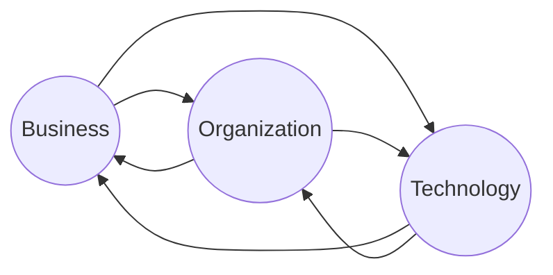
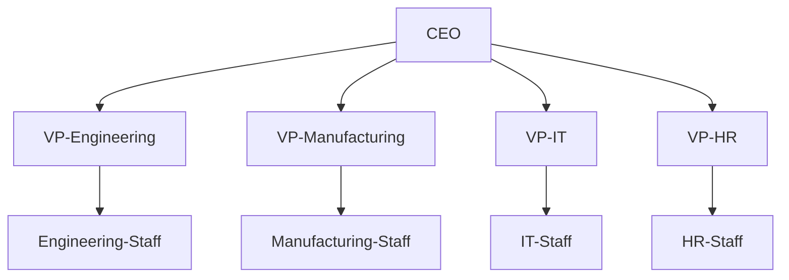
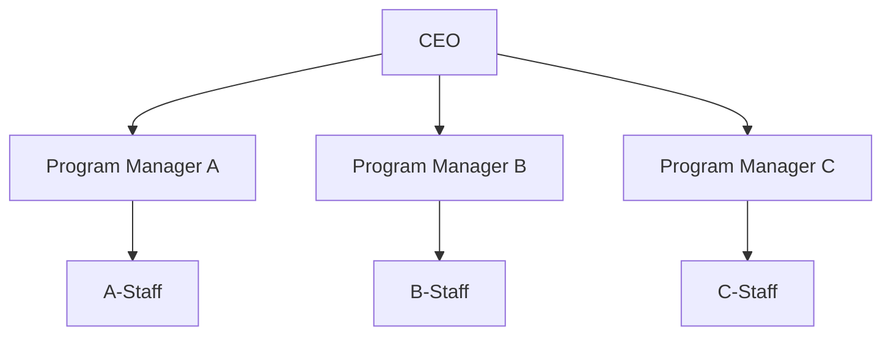
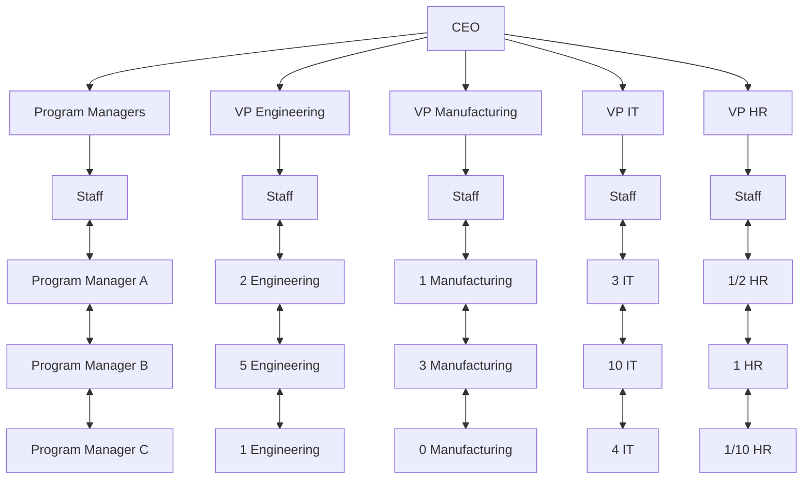

# Semaine 2

## Pensée Systématique

### Systems Approach

Une approche holistique et analytique pour resoudre des problèmes complèxes, qui inclut l'utilisation de:
+ Systems philosophy
+ Systems analysis
+ Systems management

> Systems are sets of interacting components that work within an environment to fulfill some purpose.

> **Systems philosophy** is an overall model for thinking about things as systems.

> **Systems analysis** is a problem-solving approach that requires defining the scope of the system.

> **Systems management** addresses the business, technological, and organizational issues associated with creating, maintaining, and modifying a system.

### Three Sphere Model for Systems Management

## Cycle de vie des Projets

+ Les projets se divise en **phases**
    + L'ensemble des phases est appelé "cycle de vie du projet"
    + Chaque phase comporte des **livrables** et des tâches spécifiques

> Un livrable est un produit ou service réalisé dans le cadre du projet.

### Cycle de vie traditionnelle de projet

Generic Project life cycle:
1. Starting the project
2. Organizing and preparing
3. Carrying out the work
4. Finishing the project

## Les groupes de processus en gestion de projet

**Démarrage**:
+ Ensemble des activités permettant de définir et d'autoriser ou une phase d'un projet et d'assurer qu'un mandat clair ait été donné

**Planification**:
+ Ensemble des activités permettant d'affiner les objectifs d'un projet, d'identifier toutes les ations requises pour assurer l'atteinte de ces objectifs, d'en évaluer les efforts, durées et coûts, et d'en planifier le déroulement à l'intérieur des contraintes auxquelles le projet est soumis

**Exécution**:
+ Ensemble des activités permettant d'intégrer les ressources retenues pour exécuter le plan du projet et d'assurer le suivi au quotidien de leurs actions et interactions tout en veillant au respect de l'envergure du projet

**Contrôle**:
+ Ensemble des activités permettant de mesurer régulièrement les efforts, les coûts et la progression du projet pour identifier les écarts par rapport au plan de projet de manière à permettre d'identifier et d'appliquer à temps les actions correctives nécessaires et à atteindre les objectifs du projet

**Clôture**:
+ Ensemble des activités permettant de formaliser l'acceptation des biens livrables par le client et de conclure le projet ou la phase les ayant produits, tout en permettant de tirer les leçons qui s'imposent pour les projets futurs

## La Cycle de Vie des Produits

**Product life cycle**
+ A process used to define, create, and deliver products
+ Developing a product often involves many projects

### Systems Development Life Cycle (SDLC)

> SDLC est les phases incluses dans le développeent et le maintient de produits informatique.

Types de développement de logiciels:
+ **Predictive life cycle**:
    + La portée, l'échéancier et les coûts sont prévisible et déterminés
    + Ajoustement de la portée pendant la cycle de vie
+ **Adaptive Software Development (ASD) life cycle**:
    + Approche de développement flexible pour répondre à des besoins flous ou changeants
    + La portée détaillée est définée et appreuvé avant le démarrage de chaque itération
    + Un produit fonctionnel à la fin de chaque itération
    + Ex: Agile

> Les critères de passage d'une phase à l'autre par la direction qu'on appele "**Porte** de phase" ou "**Kill points**", est important à déterminer si un projet doit être terminé ou continué.

## Predictive Life Cycle Models

+ **Waterfall model**
    + has well-defined, linear stages of systems development and support
+ **Spiral model**
    + shows that software is developed using an iterative or spiral approach rather than a linear approach
+ **Incremental build model**
    + provides for progressive development of operational software
+ **Prototyping model**
    + used for developing prototypes to clarify user requirements
+ **Rapid Application Development (RAD) model**
    + used to produce systems quickly without sacrificing quality

## Les Organizations

Les 4 cadres d'organization:

Structural frame | Human Resources frame | Political frame | Symbolic frame
---|---|---|---
Focuses on roles and responsibilities, coordination and control. Organization charts help define this frame | Focuses on providing harmony between needs of the organization and needs of people | Assumes organizations are coalitions composed of varied individuals and interest groups. Conflict and power are key issues | Focuses on symbols and meanings related to events. Culture is important

## Structures Organizationnelles

**Functional**: functional managers report to the CEO
+ Pros
    + Clear definition of authority
    + Eliminates duplication
    + Encourages specialization
    + Clear career paths
+ Cons
    + Can lack customer orientation
    + Create longer decision cycles
    + Conflicts across functional areas
    + Project leaders have little power

**Projet**: program managers report to the CEO
+ Pros
    + Unity of command
    + Effective inter-project communication
+ Cons
    + Duplication of facilities
    + Career path

**Matrix**: middle ground between functional and project structures
> Stucture can be weak, balanced, or strong matrix

+ Pros
    + Project integration across functional lines
    + Efficient use of resources
    + Retains functional teams
+ Cons
    + Two bosses for personnel
    + Complexity
    + Resource & priority conflicts

## Organizational Culture

Organizational culture is a set of shared assumptions, values, and behaviors that characterize the functioning of an organization.

10 characteristics of Organizational Culture:
+ Member identity
+ Group emphasis
+ People focus
+ Unit integration
+ Control
+ Risk tolerance
+ Reward criteria
+ Conflict tolerance
+ Means-ends orientation
+ Open-systems focus

## Importance of Top Management Commitment

People in top management positions are key stakeholders in projects.
+ A very important factor in helping project managers successfully lead projects is the level of commitment and support they receive from top management.

> Some projects have a senior manager called a **champion** who acts as a key proponent for a project.

### How Top Management can help Project Managers

+ Providing adequate resources
+ Approving project needs in a timely manner
+ Getting cooperation from other parts of the organization
+ Mentoring and coaching on leadership issues

> **IT governance** addresses the authority and control for key IT activities in organizations, including IT infrastructure, IT use, and project management.

+ Having a Chief Information Officer (CIO) in the organization helps IT projects