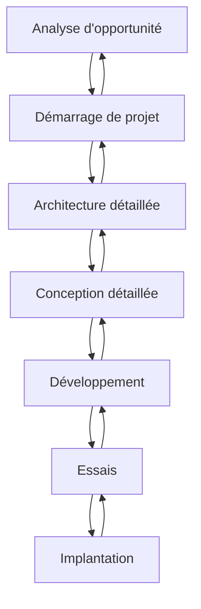

# Semaine 3

## SWOT Analysis

+ Strength (Forces)
+ Weakness (Faiblesses)
+ Opportunities (Opportunités)
+ Threat (Menaces)

## Plan directeur

Le plan directeur documente ce qui doit être fait durant les 3 à 5 prochaines années.

### Objectifs du plan directeur

+ Identifier les projets de développement et d'implantation de systèmes, qui vont supporter l'entreprise
+ Identifier les TI requises
+ Construire un premier modèle des systèmes d'information de l'entreprise
+ Définir l'organisation à mettre en place

### Les extrants du plan

+ Un modèle des SI de l'entreprise
+ Un portefeuille de projets rangés par priorité
+ Des orientations technologiques
+ Une enveloppe budgétaire
+ Un mode de gestion

## Le processus de planification

+ La construction d'un modèle d'entreprise
+ Le positionnement des systèmes actuels
+ L'évaluation des besoins
+ L'étude de la technologie requise
+ La définition des priorités
+ L'élaboration du plan
+ Le mode de gestion des TI

## Management de l'intégration

+ Élaborer la charte du projet

+ Élaborer l'énoncé préliminaire du contenu du projet

+ Élaborer le plan de management du projet

+ Diriger et piloter l'exécution du projet

+ Surveiller et maîtriser le travail du projet

+ Maîtrise intégrée des modification

+ Clore le projet

## Démarrage de projet

Objectif: Planifier en détail le projet pour obtenir une approbation du client

Activités: Analyse d'impact (établir la liste des travaux), planification détaillée

Livrable: Charte/Manuel de projet, Planification détaillée, plan des ressources, budget plus précis, plan d'acquisition

Extrant: Le client approuve/rejette le projet investissement

### Trois documents principaux du projet

+ Charte du projet
+ Énoncé du contenu du projet
+ Plan de management du projet

 ## La Charte du projet

 La charte du projet a pour but principal la documentation des besoins commerciaux, la justification du projet et la compréhension à ce stade des exigences du client ainsi que du nouveau produit, service ou résultat destiné à les satisfaire.

+ La charte est le principal livrable de l'étape de démarrage de projet

La charte de projet couvre (entre autres):
+ Définition du projet (brève)
+ Objectifs ou justification du projet
+ Inclus dans la portée
+ Exclus de la portée
+ Les parties prenantes
+ Hypothèses et contraintes
+ Budget
+ Échéancier

## L'Énoncé du Contenu du projet

L'énoncé du contenu du projet est la définition du projet, c'est-à-dire ce qui doit être accompli. L'énoncé préliminaire du contenu du projet étudie et documente les caractéristiques et les limites du projet et des produits et services correspondants, ainsi que les méthodes d'acceptation et de maîtrise du contenu.

Un énoncé du contenu du projet comprend les éléments suivants (entre autres):
+ Définition du projet (détaillée)
+ Portée du projet
+ Objectifs du projet
+ Contexte du projet
+ Les hypothèses
+ Les contraintes
+ Les princiopaux risques
+ Les facteurs de succès
+ Budget et coûts
+ Modalité de facturation/imputation
+ Critères de satisfaction ou d'acceptation
+ L'échéancier
+ Les biens livrables

## Le Plan de Management du projet

Le plan de management du projet définit la manière dont le projet est exécuté, surveillé et maîtrisé, et clos.

> def. Manuel d'Organisation de Projet (MOP)

Un plan de management du projet comprend les éléments suivants (entre autres):
+ Plan de gestion du contenu
+ Plan de gestion de l'échéancier
+ Plan de gestion des coûts
+ Plan de gestion de la qualité
+ Plan de gestion des ressources humaines
+ Plan de gestion des communications
+ Plan de gestion des risques
+ Plan de gestion des approvisionnements

## La rencontre de démarrage

La rencontre de démarrage (ou les rencontres) sert à informer toutes les parties prenantes sur le projet en début de projet, de manière à aligner tous et chacun dans la même direction.

Contenu de la rencontre de démarrage:
+ Définition du projet
+ Portée du projet (inclus et exclus)
+ Objectifs du projet
+ Contexte du projet
+ Les parties prenantes
+ Les principaux risques
+ Les facteurs de succès
+ Budget et coûts
+ Critères de satisfaction ou d'acceptation
+ L'échéancier
+ Les biens livrables
+ Les modalités de gestion
+ Les rôles du projet

Participants à la rencontre de démarrage
+ Le client et ses représentants
+ L'équipe de projet
+ Un ou des représentants de la direction de la firme effectuant les travaux

## La facilitation

La facilitation c'est l'art d'avoir du leadership sans prendre le contrôle.

Le facilitateur est:
+ Neutre en tout temps
+ Procure une structure de discussions qui aide le groupe à prendre des décisions efficaces

Une facilitateur contribue au succès de la rencontre en:
+ Supportant les membres à gérer leur propre dynamique interpersonnelle
+ Donnant de la rétroaction au groupe pour qu'il comprennent leurs progrès et qu'il fassent les ajustements requis
+ Utilisant une approche collaborative pour gérer les conflits
+ Aidant le groupe à communiquer efficacement

