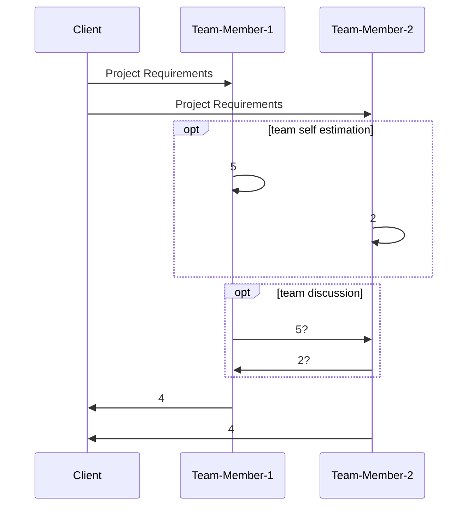

# Semaine 5

## Project Cost Management

> Cost overrun: The additional percentage or dollar amount by which actual costs exceed estimates.

+ Couts
    + une ressource investi pour atteindre un objectif

+ Gestion des coûts de projet
    + Les processus requis pour s'assurer que le projet est réalisé à l'intéerieur du budget établi

### Relation Durée-efforts-unités

> Durée = Efforts / Unités

+ Durée
    + Mesure de la durée d'une tâche (en jours)
+ Efforts
    + Jours personnes requis pour effectuer une tâche
    + ex: 5 jours-personnes = Une semaine de travail pour une personne
+ Unités
    + Disponibilité de la ressource

Ex: Une tâche d'analyse fonctionnelle requiert 10 J/p efforts mais l'analyste n'est disponible qu'à 25% de son temps:
> Durée = E / U = 10 / 0.25 = 40 Jours

### Les Processus

+ Estimation des coûts
    + Produire un estimé des coûts des ressources requises pour réaliser un projet
+ Le Budget
    + Réfère à l'allocation des coûts globaux estimés aux éléments à réaliser en projet (work items)
    + Ce budget de départ (appelé **baseline**) servira de mesure de comparaison/suivi pour la reste du projet
+ Contrôle des coûts
    + Gérer les changements aux coûts en cours de projet

### Basic Principles of Cost Management

**Learning curve theory** states that when many items are produced repetitively, the unit cost of those items decreases in a regular pattern as more units are produced.

**Reserves** are dollars included in a cost estimate to mitigate cost risk by allowing for future situations that are difficult to predict.

### Plan de gestion des coûts 

Un **plan de gestion de coûts** est un document qui explique comment les coûts seront gérés en projet.

+ Une portion importante des coûts totaux des projets sont les coûts de main d'oeuvre

### Techniques d'estimation des efforts et des coûts

Type of Estimate | Time Period | Objective | Accuracy
---|---|---|---
Rough Order of Magnitude (ROM) | Very early in the project life cycle | Provides estimate of cost for selection decisions | -50% to +100%
Budgetary | Early | Puts dollars in the budget plans | -10% to +25%
Definitive | Later in the project | Provides details for purchases, estimates actual costs | -5% to +10%

### La Contingence

La contingence est une réserve pour les activités qui ne peuvent être prévues.
+ La contingene n'est pas une réserve pour la variance normale d'un projet ou pour les changements de la portée
+ 2 types principaux
    + Risque
    + Gestion

### Techniques d'estimation

+ **Analogie** ou du **général au particulier**
    + utilise les coûts actuels d'un projet similaire comme base d'estimation du projet
    + Cette méthode consiste en donnant un coût global du projet basé sur ses caractéristiques générales.
    + Le coût est réparti parmi les différentes composantes du projet
+ **Du particulier au général**
    + signifie l'estimation des activités et livrables détaillés pour en dégager un estimé global
    + Cette méthode produit un estimé pour toutes les composantes du projet et l'estimé final est obtenu en faisant la somme des estimés de chacune des composantes
+ **Paramêtres/Modèle mathématique**
    + Utilise des paramètres du projet dans un modèle mathématique pour en dégager un estimé global

### Paramètres

+ Lignes de codes (LOC)
    + Avantages
        + Mesure commune
        + Facile à estimer
    + Désavantages
        + Ne touch qu'à la partie développement
        + Difficile d'avoir un estimé tôt dans le projet car le code arrive loin
        + Influence du choix de langage

+ Point de fonction
    + Cette méthode repose sur la vision de l'utilisateur en terme d'entrées, de sorties, d'interrogations, d'informations à conserver et de mode de fonctionnement
    + On peut estimer **une partie** des efforts d'un projet par son nombre de points de fonctions
    + Avantage
        + Plus structuré comme approche que les lignes de code (LOC)
    + Desavantage
        + N'addresse pas spécifiquement les problématiques des progiciels dans les organisations

### COCOMO

COCOMO (COnstructive COst MOdel) est un modèle permettant de définir une estimation de l'effort à fournir dans un développement logiciel et la durée que ce dernier prendra en fonction des ressources allouées.

### Conséquences d'estimés sur & sous-évalués

+ Estimés trop élevés
    + Le projet n'aura pas lieu
    + Parkinson's Law: Le travail s'étire pour prendre 100% du budget alloué
+ Estimés trop faibles
    + Problèmes de qualité
    + Impossible de rencontrer les délais
    + Problème d'engagement des ressources et perte de confiance envers le chargé de projet

### Présenter les Estimés

Differentes techniques:
+ Avec des +/-
    + 6 mois +/- 1 mois
    + 1000 J/P +/- 100 J
+ Période
    + 6 à 8 mois
    + de 1000 à 1200 J/P
+ Avec qualification du risque
    + +1 mois selon la mise en route des outils de développement
    + -2 semaines selon l'embauche des développeurs et analystes
+ En fonction des probabilité
    + Meilleur scénario
    + Pire scénario
    + Scénario planifié
+ Haut niveau
    + Q3 de 2025
+ Avec facteur de confiance
    + 1er Avril - 10% de probabilité

### Poker Planning

