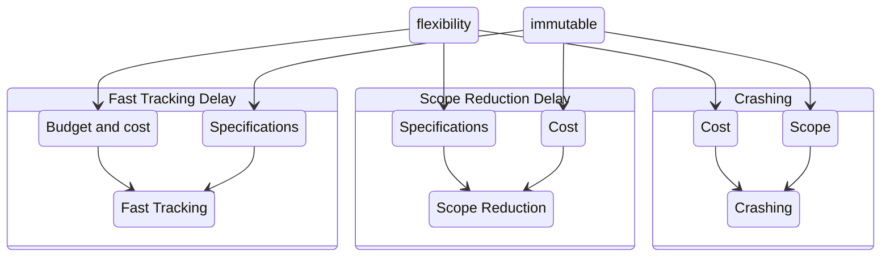

# Semaine 6

## Ordonnacement

### Terminologie

+ **Activité/Tâches**: Action à poser qui entraînera la consommation de temps et possiblement d'autres ressources
+ **Critique**: Activité ou événement qui doit être complété à un certain moment sans bénéficier d'aucune latitude dans le temps (flottement)
+ **Chemin Critique**: Chemin le plus long dans le réseau
    + détermine la date la plus hâtive à laquelle le projet peut être complété
+ **Événement**: Début ou fin d'une activité - moment spécifique
+ **Réseau**: Représentation graphique
+ **Durée**: Efforts/unités
    + La **durée** représente le temps calendrier que prendra une tâche
    * Les **efforts** représentent le nombre de Jours/Personnes qui seront requis pour effectuer cette tâche
+ **Jalon (milestone)**: Événement qui représente un point dans le projet avec une signification particuliere
    + Généralement la fin d'une phase ou étape d'une projet
    + Possède normalement une durée de zéro
    + Utilisé pour des points de revus ou décision de votre projet

### Objectifs d'Ordonnancement

+ Identifier la durée du projet optimale
+ Au plus bas coût
+ Avec le mmoins de risques
+ Déterminer les choix possibles
+ Utilisation plus efficaces des ressources
+ Outils de communication

### Définition de l'ordonnancement des tâches

> L'Ordonnancement est un processus qui permet d'inscrire dans le temps chacune des activités du projet en fonction de leur durée et de leurs interdépendances.

L'Ordonnancement des tâches permet de déterminer quelles ressources seront nécessaires à quel moment, et d'en déduire les enjeux qui en découlent en termes d'intégration, d'approvisionnement, de communication et de syergie entre les individus, équipes, processus.

+ L'ordonnacement est souvent suivi d'un nivellement des ressources qui permet, en fonction des niveaux de flottements identifiés, de minimiser les fluctuation au niveau des ressources

### 4 types de dépendances sur les tâches

+ **Obligatoires**
    + Selon la nature du travail
+ **Discrétionnaire**
    + Souvent déterminé par l'équipe du projet ou le chargé de projet
    + Selon les processus en place
+ **Externes**
    + Provient d'un élément externe au projet
+ **Ressources**
    + 2 Tâches dépendent de la même ressource

### Techniques pour estimer l'effort

Il est souvent utile de donner 3 scénarios ou possibilités
+ Optimiste
+ Réaliste
+ Pessimiste

**PERT weighted average**
> PERT weighted average =  (optimistic time + 4x most likely time + pessimistic time) / 6

#### Diagramme de Gantt

Résultat des effort de Henry Gantt qui a développé un système complet de ntoation pour montrer l'avancement des projets à l'aide des diagrammes en bâtonnets.

+ **Avantages**
    + Facile à comprendre, créer, maintenir
+ **Désavantages**
    + Parfois difficile de voir les dépendances
    + Ne permet pas facilement de tenir compte des incertitudes reliées à certaines tâches

```mermaid
gantt
    title Example Gantt Diagram of Project Time Management Processes
    dateFormat DD
    section Project Time Management
        Define Activities           :2024-11-14, 3d
        Sequencee Acitivities       :2024-11-15, 7d
        Estimate Activity Resources :2024-11-16, 6d
        Develop Schedule            :2024-11-19, 4d
        Control Schedule            :2024-11-23, 10d
```

#### Critical Path Method (CPM)

**CPM** is a network diagramming technique used to predict total project duration.

> A **critical path** for a project is the series of activities that determines the earliest time by which the project can be completed.

+ The critical path is the longest path through the network diagram and has the least amount of slack or float
+ **Slack** or **float** is the amount of time an activity may be delayed without delaying a succeeding activity or the project finish date
+ The critical path is **not** the one with all the critical activities. It only accounts for time
+ The critical path can change as the project progresses

##### Calculating the Critical Path

1. Develop a good network diagram
2. Add the duration estimates for all activities on each pat through the network diagram
3. The longest path si the critical path
4. If one or more of the activities on the critical path takes longer than planned, the whole project schedule will slip unless the project manager takes corrective action

##### Updating Critical Path Data

+ The critical path may change as you enter actual start and finish dates
+ If you know the project completion date will slip, negotiate with the project sponsor

### Buffers

A **buffer** is additional time to complete a task.
+ Murphy's Law states that if something can go wrong, it will
+ Parkinson's Law states that work expands to fill the time allowed

### Nivellement

Le nivellement (lissage) vise à:
+ S'assurer que le niveau total des ressources requises à tout moment du projet ne dépasse pas le niveau maximal de disponibilité de ressources
+ Minimiser les fluctuations dans le nombre de ressources utilisées

Pour effectuer ce nivellement, on tiendra compte:
+ Du flottement dans les activités **non critiques**
+ De la latitude réelle sur les coûts, les spécifications et l'échéancier

> Le nivellement demeure un objectif important mais qui ne doit pas pour autant causer plus de problèmes qu'il n'en résout.

### Techniques de gestion de projet

