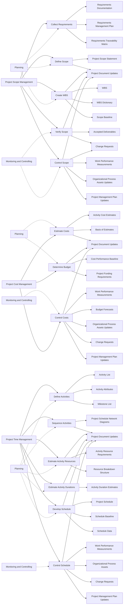

# Semaine 6

## Le triangle Produit-Coûts-Échéancier

+ Project Scope Management
+ Project Cost Management
+ Project Time Management

### Deliverable input output map

```mermaid
    flowchart LR
        scope_process1[Collect Requirements]
        scope_process2[Define Scope]
        scope_process3[Create WBS]
        scope_process4[Verify Scope]
        scope_process5[Control Scope]
        scope_management[Project Scope Management]
        scope_management --> scope_process1
        scope_management --> scope_process2
        scope_management --> scope_process3
        scope_management --> scope_process4
        scope_management --> scope_process5
        planning1[Planning]
        control1[Monitoring and Controlling]
        planning1 -.-> scope_process1
        planning1 -.-> scope_process2
        planning1 -.-> scope_process3
        control1 -.-> scope_process4
        control1 -.-> scope_process5
        scope_output1[Requirements Documentation]
        scope_output2[Requirements Management Plan]
        scope_output3[Requirements Traceability Matrix]
        scope_output4[Project Scope Statement]
        scope_output5[Project Document Updates]
        scope_output6[WBS]
        scope_output7[WBS Dictionary]
        scope_output8[Scope Baseline]
        scope_output10[Accepted Deliverables]
        scope_output11[Change Requests]
        scope_output13[Work Performance Measurements]
        scope_output14[Organizational Process Assets Updates]
        scope_output16[Project Management Plan Updates]
        scope_process1 --> scope_output1
        scope_process1 --> scope_output2        
        scope_process1 --> scope_output3        
        scope_process2 --> scope_output4        
        scope_process2 --> scope_output5        
        scope_process3 --> scope_output6        
        scope_process3 --> scope_output7        
        scope_process3 --> scope_output8        
        scope_process3 --> scope_output5        
        scope_process4 --> scope_output10        
        scope_process4 --> scope_output11       
        scope_process4 --> scope_output5       
        scope_process5 --> scope_output13       
        scope_process5 --> scope_output14       
        scope_process5 --> scope_output11       
        scope_process5 --> scope_output16       
        scope_process5 --> scope_output5       

        cost_management[Project Cost Management]
        cost_process1[Estimate Costs]
        cost_process2[Determine Budget]
        cost_process3[Control Costs]
        cost_output1[Activity Cost Estimates]
        cost_output2[Basis of Estimates]
        cost_output3[Project Document Updates]
        cost_output4[Cost Performance Baseline]
        cost_output5[Project Funding Requirements]
        cost_output7[Work Performance Measurements]
        cost_output8[Budget Forecasts]
        cost_output9[Organizational Process Assets Updates]
        cost_output10[Change Requests]
        cost_output11[Project Management Plan Updates]
        planning2[Planning]
        control2[Monitoring and Controlling]
        planning2 -.-> cost_process1
        planning2 -.-> cost_process2
        control2 -.-> cost_process3
        cost_process1 --> cost_output1
        cost_process1 --> cost_output2
        cost_process1 --> cost_output3
        cost_process2 --> cost_output4
        cost_process2 --> cost_output5
        cost_process2 --> cost_output3
        cost_process3 --> cost_output7
        cost_process3 --> cost_output8
        cost_process3 --> cost_output9
        cost_process3 --> cost_output10
        cost_process3 --> cost_output11
        cost_process3 --> cost_output3
        cost_management --> cost_process1
        cost_management --> cost_process2
        cost_management --> cost_process3

        time_management[Project Time Management]
        time_process1[Define Activities]
        time_process2[Sequence Activities]
        time_process3[Estimate Activity Resources]
        time_process4[Estimate Activity Durations]
        time_process5[Develop Schedule]
        time_process6[Control Schedule]
        time_management --> time_process1
        time_management --> time_process2
        time_management --> time_process3
        time_management --> time_process4
        time_management --> time_process5
        time_management --> time_process6
        time_output1[Activity List]
        time_output2[Activity Attributes]
        time_output3[Milestone List]
        time_output4[Project Schedule Network Diagrams]
        time_output5[Project Document Updates]
        time_output6[Activity Resource Requirements]
        time_output7[Resource Breakdown Structure]
        time_output9[Activity Duration Estimates]
        time_output11[Project Schedule]
        time_output12[Schedule Baseline]
        time_output13[Schedule Data]
        time_output15[Work Performance Measurements]
        time_output16[Organizational Process Assets]
        time_output17[Change Requests]
        time_output18[Project Management Plan Updates]
        time_process1 --> time_output1
        time_process1 --> time_output2
        time_process1 --> time_output3
        time_process2 --> time_output4
        time_process2 --> time_output5
        time_process3 --> time_output6
        time_process3 --> time_output7
        time_process3 --> time_output5
        time_process4 --> time_output9
        time_process4 --> time_output5
        time_process5 --> time_output11
        time_process5 --> time_output12
        time_process5 --> time_output13
        time_process5 --> time_output5
        time_process6 --> time_output15
        time_process6 --> time_output16
        time_process6 --> time_output17
        time_process6 --> time_output18
        time_process6 --> time_output5
        planning3[Planning]
        control3[Monitoring and Controlling]
        planning3 -.-> time_process1
        planning3 -.-> time_process2
        planning3 -.-> time_process3
        planning3 -.-> time_process4
        planning3 -.-> time_process5
        control3 -.-> time_process6
```