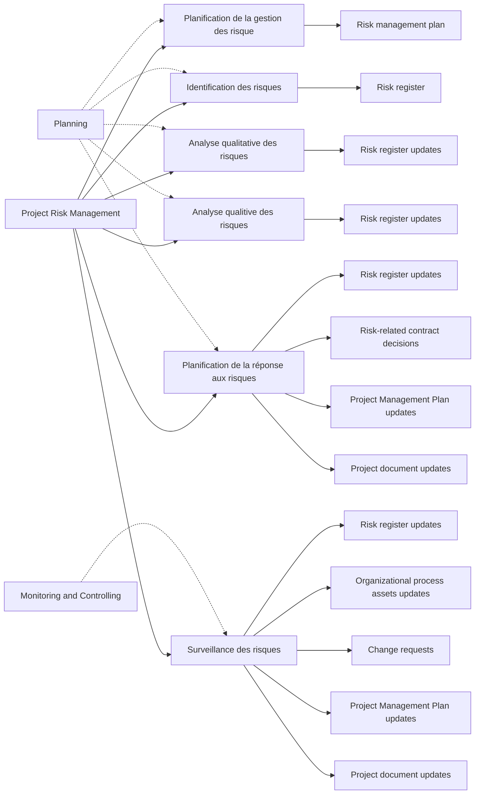
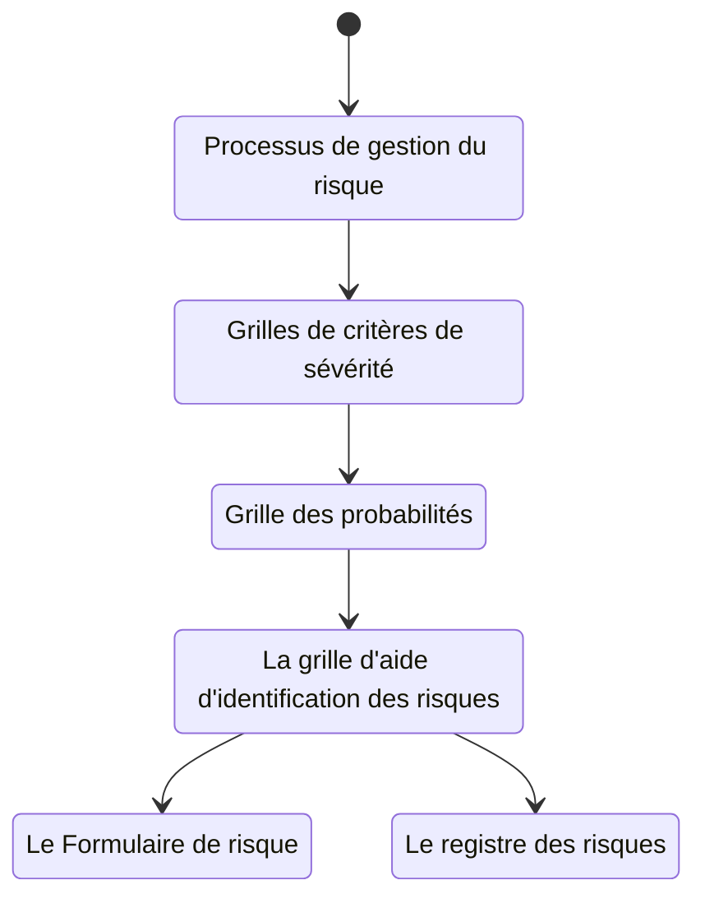
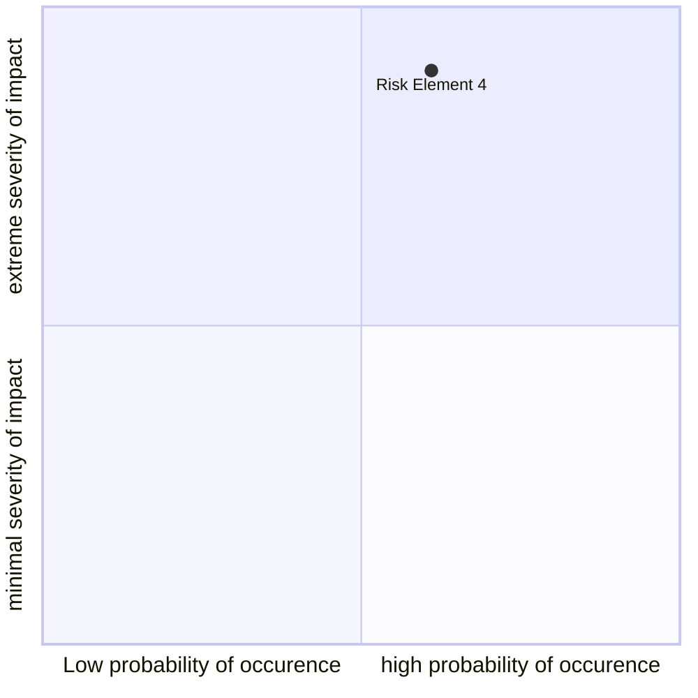

# Semaine 7

## La Gestiono du Risque

### Définitions du Risque

> Le **risque** est la mesure de la probabilité et des conséquences de ne pas rencontrer les objectifs d'un projet. -*SEI (Software Engineering Institute)*

> La gestion du risque est:
> + le processus formel par lequel les facteurs de risque sont systématiquement identifiés, estimés et pris en compte 
> + une méthode formelle et systématique de gestion qui se concentre sur lidentification et le contrôle des événements ayant un potentiel de causer un changement non désiré
>
> -*PMI (Project Management Institute)*

+ **Dictionnaire**: Danger éventuel plus ou moins prévisible
+ Le risque possède trois composantes:
    + **l'événement**
        + causant un changement indésirable
    + la **probabilité**
        + occurence de cet événement
    + **l'impact**
        + la conséquence de cet événement

> Le chargé de projet ne peut souvent intervenir que sur les aspects de probabilité et impacts.

### Types de risques

+ Planification (échéancier)
    + Compression (client, marketing, etc.)
+ Coûts
    + Budgets trop faibles
+ Besoins
    + confus, contradictoires
    + volatiles
+ Qualité
    + En deçà des attentes
+ Opérationnels
    + Ressources non disponibles

### Definition d'un risque

+ Description:
    + Titre du risque
    + Si
        + événement
    + Alors
        + impact
        + probabilité
+ Exposition:
    + Aide à établir une réserve (contingence)
    + Probablité x Impact
        + probabilité en %
        + Impact en unité appropriée ($, efforts, part de marché, etc.)

### Défintions de l'incertitude

+ Connu/Connu (Known-Known)
    + Le risque est identifié, vous savez s'il va se réaliser ou pas et vous en connaissez l'impact.
    + Pas un risque, c'est une certitude
+ Connu/Inconnu (Known-Unknown)
    + Le risque est identifié mais sa probabilité de se matérialiser ou son impact sont inconnu.
    + Un risque
+ Inconnu/Inconnu (Unknown-Unknown)
    + Vous n'avez aucune idée que le risque existe
    + Vous n'avez donc pas idée de sa probabilité ou de son impact

### Processus de gestion du risque

Selon le PMI les processus de gestion du risque sont:

#### Planificaiton de la gestion des risques

+ Formalisation de comment sera géré les risques dans l'organization
+ Établissement des grilles de critères de sévérité et d'aide à l'identification des risques
+ Définition des catégories de risque
    + Client
    + Équipe de projet (RH)
    + Produit
    + Procédé
    + Marché
    + Technologie
    + Ressources matérielles (RM)
    + Ressources financières (RF)
+ Définition du formulaire de description d'un risque
+ Définition du registre des risques

##### Grille d'aide a l'identification du risque

Catégorie 1 | Note: Les questions ci-dessous servent à rédiger la partie du "Si" dans la description du risque
---|---
Sujet 1 | Question 1-5
Sujet 2 | Question 1-5

##### Grille de critères de sévérité du risque

Cote de sévérité | Impact en (catégorie)
---|---
Élevé | critère
Moyen | critère
Faible | critère

##### Grille des probabilités

Expressions courantes | Correspondance de probabilité
---|---
selon toute vraisemblance | 85% à 100%
très fortes probabilités |
de très bonnes chances |
très probable |

#### Identification des risques

+ Identification des sources de risque
+ Identification des événements potentiels pouvant causé des changements indésirables
+ Identification des syumptômes annonçant la matérialisation
+ Rédaction sous forme "Si..., Alors..."
+ Début de la rédaction du formulaire du risque

##### Profil des risques

+ Exigences techniques
+ Conception
+ Phase de validation
+ Développement
+ Calendrier de travail
+ Budget
+ Qualité
+ Gestion
+ Environment de travail
+ Personnel
+ Client
+ Entrepreneurs

#### Analyse des risques

+ Quantification des impacts (en $, en efforts, en parts de marché, en satisfaction client...)
+ Établissement de la sévérité selon les grilles des critères de la sévérité
+ Établissement de la probabilité selon la grille des probabilités
+ Calcul de l'exposition
    + Expositon = Probabilité x Impact
+ Poursuite de la rédaction du formulaire du risque

#### Planification de la réponse aux risques

Choisir la stratégie de mitigation du risque:

+ Acceptation
+ Évitement
+ Protection
+ Réduction
+ Réserve (contingence)
+ Transfert
+ Recherche
+ autres

##### Formulaire d'évaluation

Risque | Probabilité | Impact | Difficulté de détection | Étape de réalisation possible
---|---|---|---|---
**Problèmes d'interface** | 4 | 4 | 4 | Conversion
**Pannes du système** | 2 | 5 | 5 | Démarrage
**Réticence des utilisateurs** | 4 | 3 | 3 | Postinstallation
**Mauvais fonctionnement du matériél** | 1 | 5 | 5 | Installation

##### Matrice des risques

Probabilité de réalisation / Impact | 1 | 2 | 3 | 4 | 5
---|:-:|:-:|:-:|:-:|:-:
**1** | | | | | ==mauvais fonctionnement du matériel==
**2** | | | | | ==panne du système==
**3** | | | | |
**4** | | ==résistance des utilisateurs== | ==problème d'interface== |
**5** | | | | |

##### Plan de gestion de risque

Décrire l'approche de mitigation du risque

Étape | Description de la mesure de mitigation | Responsable de la mesure | Date début | Date fin | État
---|---|---|---|---|---
1 | | | | |

##### Stratégies de réponse

###### Réduction du risque

+ Limiter la probabilité de réalisation du risque
+ Minimiser l'impact du risque

###### Élimination du risque

+ Modifier le plan de projet
+ Utiliser une technologie alternative

###### Transfert du risque

+ Contrat à forfait
+ Garantie
+ Assurance

###### Partage du risque

+ Partage des coûts
+ Partage de la main-d'oeuvre

###### Acceptation du risque

+ Choix délibéré et éclairé de l'équipe de projet d'accepter le risque se présentant à eux

##### Matrice de réponse (Exemple)

Événement à risque | Réponse | Plan de substitution | Déclencheur | Responsable
---|---|---|---|---
Problèmes d'interface | Réduire | Opter pour une solution de rechange en attendant de l'aide | Pas résolu en 24 heures | Nicole
Pannes du système | Réduire | Réinstaller le système d'exploitation | Toujours en panne après une heure | Emma
Réticence des utilisateurs | Réduire | Augmenter le personnel de soutien | Appel de la haute direction | Youssef
Mauvais fonctionnement de l'équipement | Transférer | Commander d'autres marques | Le matériel de remplacement ne fonctionne pas | Jonathan

#### Surveillances des risques

+ Mise en application des stratégies de mitigation et de leurs approches
+ Mise à jour des informations sur les risques par le cycle (identification, analyse et planification de la réponse au risque) en regard des risques déjà identifiés ou pour un nouveau risque
+ Ajustements ou actions correctives en regard des risques
+ Comité de suivi / Gestion des risques

##### Techniques de quantification du risque

+ Calcul de l'exposition (contingence = probabilité x impact)
+ Sommes statistiques
    + Distribution triangulaire
    + Distribution Bêta
    + Calcul des valeurs
        + Pessimistes
        + Optimistes
        + Plus probable
        + Écart type
        + Variance
+ Simulation
    + Monte Carlo
        + Simulation de plusieurs déroulement de l'échéancier
+ Arbres de décision
+ Jugement d'experts

### Les participants de la gestion du risque

+ Le gestionnaire de projet
+ Les membres de l'équipe de projet
+ Les res ressources des disciplines impliquées dans le projet
+ Les différentes fonctions de l'organisation
+ La direction
+ Le client et son personnel

### Système de base en gestion du risque

+ Le processus de gestion du risque - 2 à 4 pages
+ La ou les grilles de critères de sévérité - 1/3 de page par grille
+ La grille des probabilités
+ La grille d'aide d'identification des risques - 2 à 5 pages
+ Le formulaire de risque - 1 à 3 page / Le registre des risques - 1 page

#### Grille d'aide d'identification des risques

#### 9 risques les plus importants en TI

+ Besoins d'affaires mal définis, instables et croissants
+ Échéancier irréaliste
+ Mesure de performance inadéquate
+ Mauvaise gestion
+ Estimation erronée
+ Le syndrome de la balle d'argent (Silver Bullet)
+ Faible qualité des livrables
+ Faible productivité de l'équipe
+ Projet annulé

## Information Technology Success Potential Scoring Sheet

Success Criterion | Relative Importance
---|---
User Involvement | 19
Executive Management support | 16
Clear Statement of Requirements | 15
Proper Planning | 11
Realistic Expectations | 10
Smaller Project Milestones | 9
Competent Staff | 8
Ownership | 6
Clear Visions and Objectives | 3
Hardworking, Focused Staff | 3
Total | 100